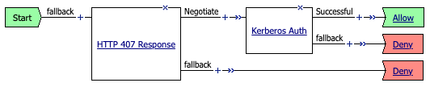

# F5 APM Forward Proxy Connection-based Kerberos Authentication
An iRule solution to implement connection-based Kerberos forward proxy authentication for F5 APM

### Description
Creates a mechanism to deploy APM Kerberos with connection-based auth behavior. APM NTLM is the only WIA method that currently supports connection-based auth (ability to persist on the authenticated user). Kerberos and Basic persist on the source IP, which is probelematic in NAT environments. This solution uses a sideband access policy evaluation to validate Kerberos credentials against a directory service, and requires the client to pass a valid authorization header in every request. The solution is optimized to query the directory service once for an authenticated user (and within expiry time).

There are different versions of the iRule for explicit and transparent forward proxy authentication methods.

### Version support
This iRule works on BIG-IP 14.1 and above, SSL Orchestrator 5.x and above.

### How to install
- Create a normal SWG-Explicit auth policy with Kerberos, attach to the explicit proxy VIP and ensure that Kerberos auth works as expected.

  `Start -> 407 -> Kerberos Auth -> Allow`
  
  

- Remove the 407 agent from the SWG-Explicit auth policy VPE, and remove the auth policy from the explicit proxy VIP.

- Attach this iRule to the explicit proxy VIP (-xp VIP in SSLO).

- Modify the following static configuration variables as required:
  - Modify the **AUTH_PROFILE** variable to reflect the name of the SWG-Explicit auth policy
  - Modify the **AUTH_SESSION_TIMER** variable to reflect needed to store "authenticated" user (shorter times more secure, but validate more often)
  - Modify the **DEBUG_AUTH** variable to enable/disable debug logging to /var/log/ltm
  - Modify the **FAILED_AUTH_ATTEMPTS** variable to enable and set a failed logon attempt counter
  - Modify the **FAILED_AUTH_TIMER** variable to adjust the time (in seconds) to track failed logon attempts for a connection

### Caveats
This iRule will generally not integrate with per-request policies.
