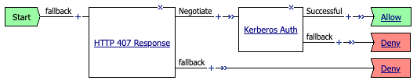

## APM Explicit Forward Proxy Connection-based Kerberos Authentication

### How to install
- Create a normal SWG-Explicit auth policy with Kerberos, attach to the explicit proxy VIP and ensure that Kerberos auth works as expected.

  `Start -> 407 -> Kerberos Auth -> Allow`
  
  

- Remove the 407 agent from the SWG-Explicit auth policy VPE, and remove the auth policy from the explicit proxy VIP.

- Attach this iRule to the explicit proxy VIP (-xp VIP in SSLO).

- Modify the following static configuration variables as required:
  - Modify the **AUTH_PROFILE** variable to reflect the name of the SWG-Explicit auth policy
  - Modify the **AUTH_SESSION_TIMER** variable to reflect needed to store "authenticated" user (shorter times more secure, but validate more often)
  - Modify the **DEBUG_AUTH** variable to enable/disable debug logging to /var/log/ltm
  - Modify the **FAILED_AUTH_ATTEMPTS** variable to enable and set a failed logon attempt counter
  - Modify the **FAILED_AUTH_TIMER** variable to adjust the time (in seconds) to track failed logon attempts for a connection

### Caveats and Considerations
It is generally not possible to attach an access policy and per-request policy to an explicit proxy VIP that contains this iRule. 

It would be possible, however, with SSL Forward Proxy configured on the TCP tunnel VIP to decrypt outbound traffic, to attach an access policy and per-request policy here. The iRule minimally collects the **session.logon.last.username** value from the sideband authentication and populates a session table entry. The table "key" is derived from the source IP amd first 400 characters of the encoded Kerberos ticket. At the end of the iRule, if a value exists in the table entry, a sharedvar is created. 

- Change the Profile Scope of the frontend Kerberos sideband authentication policy to "Named" and enter a unique Named Scope string (ex. SSLO).
- Create SSLFWD client and server SSL profiles and attach to the TCP tunnel VIP. Ensure that traffic still flows and that sites are correctly decrypted (you will see a serer certificate issued by the local CA).
- Create an SWG-Explicit access profile, select "Named" Profile Scope and enter the same scope name used above. In the VPE, set Start -> Allow.
- Create the following iRule and attach to the TCP tunnel VIP, to collect the sharedvar variable from the sideband iRule and insert into a perflow variable:

      when ACCESS_PER_REQUEST_AGENT_EVENT {
          sharedvar THISUSER
          if { [info exists THISUSER] } {
              ACCESS::perflow set perflow.custom ${THISUSER}
          }
      }

- Create a Per-Request policy of type 'All'. In the VPE, minimally add an iRule aganet at the beginning with Expect Data set to "HTTP". 

The iRule event calls the iRule on the TCP tunnel VIP and collects the authenticated username from the sharedvar variable and pushes to a perflow variable. From there add any additional logic as needed. It may also be *more* efficient to perform any directory service queries in the sideband Kerberos policy (one time per authentication step vs. per-request), and send those in the sharedvar variable (as a list object).

